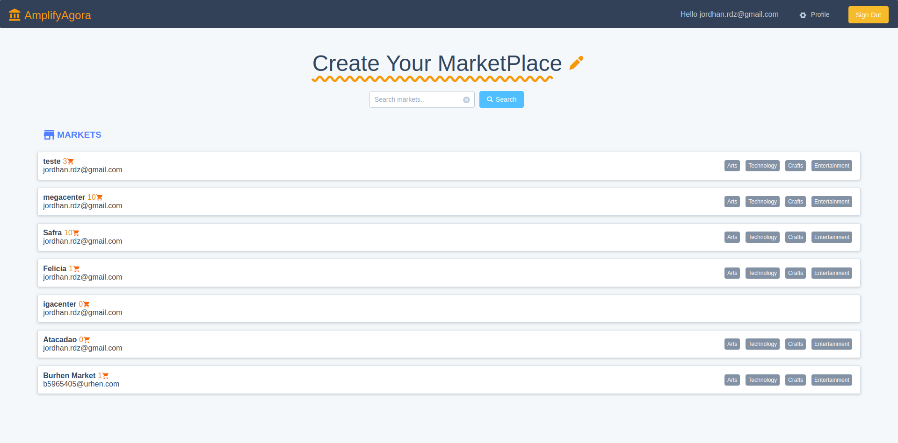

## Serverless React with AWS Amplify - The Complete Guide




## schema.graphql

```graphql
type Market @model @searchable {
  id: ID!
  name: String!
  products: [Product]
    @connection(name: "MarketProducts", sortField: "createdAt")
  tags: [String]
  owner: String!
  createdAt: String
}

type Product @model @auth(rules: [{ allow: owner, identityField: "sub" }]) {
  id: ID!
  description: String!
  market: Market @connection(name: "MarketProducts")
  file: S3Object!
  price: Float!
  shipped: Boolean!
  owner: String
  createdAt: String
}

type S3Object {
  bucket: String!
  region: String!
  key: String!
}

type User
  @model(
    queries: { get: "getUser" }
    mutations: { create: "registerUser", update: "updateUser" }
    subscriptions: null
  ) {
  id: ID!
  username: String!
  email: String!
  registered: Boolean
  orders: [Order] @connection(name: "UserOrders", sortField: "createdAt")
}

type Order
  @model(
    queries: null
    mutations: { create: "createOrder" }
    subscriptions: null
  ) {
  id: ID!
  product: Product @connection
  user: User @connection(name: "UserOrders")
  shippingAddress: ShippingAddress
  createdAt: String
}

type ShippingAddress {
  city: String!
  country: String!
  address_line1: String!
  address_state: String!
  address_zip: String!
}
```

## app.js

```javascript
var express = require("express");
var bodyParser = require("body-parser");
var awsServerlessExpressMiddleware = require("aws-serverless-express/middleware");
require("dotenv").config();
var stripe = require("stripe")("***");
var AWS = require("aws-sdk");

const config = {
  accessKeyId: "***",
  secretAccessKey: "***",
  region: "us-west-2",
  adminEmail: "***"
};

var ses = new AWS.SES(config);

// declare a new express app
var app = express();
app.use(bodyParser.json());
app.use(awsServerlessExpressMiddleware.eventContext());

// Enable CORS for all methods
app.use(function(req, res, next) {
  res.header("Access-Control-Allow-Origin", "*");
  res.header(
    "Access-Control-Allow-Headers",
    "Origin, X-Requested-With, Content-Type, Accept"
  );
  next();
});

const chargeHandler = async (req, res, next) => {
  const { token } = req.body;
  const { currency, amount, description } = req.body.charge;

  try {
    const charge = await stripe.charges.create({
      source: token.id,
      amount,
      currency,
      description
    });
    if (charge.status === "succeeded") {
      req.charge = charge;
      req.description = description;
      req.email = req.body.email;
      next();
    }
  } catch (err) {
    res.status(500).json({ error: err });
  }
};

const convertCentsToDollars = price => (price / 100).toFixed(2);

const emailHandler = (req, res) => {
  const {
    charge,
    description,
    email: { shipped, customerEmail, ownerEmail }
  } = req;

  ses.sendEmail(
    {
      Source: config.adminEmail,
      ReturnPath: config.adminEmail,
      Destination: {
        /* add customerEmail and ownerEmail to ToAddresses array after you've moved out of the sandbox for SES */

        ToAddresses: [config.adminEmail]
      },
      Message: {
        Subject: {
          Data: "Order Details - AmplifyAgora"
        },
        Body: {
          Html: {
            Charset: "UTF-8",
            Data: `
            <h3>Order Processed!</h3>
            <p><span style="font-weight: bold">${description}</span> - $${convertCentsToDollars(
              charge.amount
            )}</p>

            <p>Customer Email: <a href="mailto:${customerEmail}">${customerEmail}</a></p>
            <p>Contact your seller: <a href="mailto:${ownerEmail}">${ownerEmail}</a></p>

            ${
              shipped
                ? `<h4>Mailing Address</h4>
              <p>${charge.source.name}</p>
              <p>${charge.source.address_line1}</p>
              <p>${charge.source.address_city}, ${
                    charge.source.address_state
                  } ${charge.source.address_zip}</p>
              `
                : "Emailed product"
            }

            <p style="font-style: italic; color: grey;">
              ${
                shipped
                  ? "Your product will be shipped in 2-3 days"
                  : "Check your verified email for your emailed product"
              }
            </p>
            `
          }
        }
      }
    },
    (err, data) => {
      if (err) {
        return res.status(500).json({ error: err });
      }
      res.json({
        message: "Order processed successfully!",
        charge,
        data
      });
    }
  );
};

app.post("/charge", chargeHandler, emailHandler);

app.listen(3000, function() {
  console.log("App started");
});

// Export the app object. When executing the application local this does nothing. However,
// to port it to AWS Lambda we will create a wrapper around that will load the app from
// this file
module.exports = app;
```
